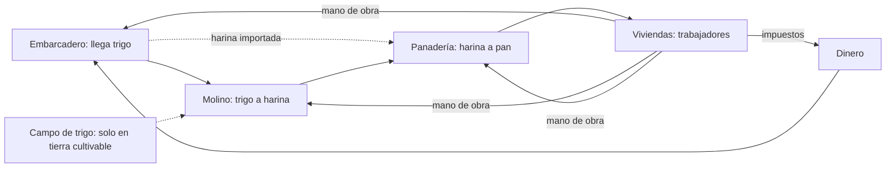

# Londinium: GDD de una página

Borrador v0.4, 8 oct 2026 (Mason). Incorpora las respuestas de Cristian, la investigación de Chronicler y la elección de la cervecería para la fase 2.

## Visión (contexto corto)

City builder de estrategia en Londres a través de varias eras. Anno es la inspiración, no el molde. Tono realista, con paralelismos históricos y figuras reales; la tensión viene del folklore de terror londinense. El jugador elige un rol (después del hito 1), el ritmo es moderado, y hay campaña y sandbox. El arte objetivo es grabado victoriano y la música es de Cristian Bergagna (horrorsynth y darkwave). Godot 4, sin IA en runtime, presupuesto casi cero.

## Primer hito: el loop económico mínimo

**La pregunta que responde el prototipo:** ¿es interesante equilibrar producción, consumo y crecimiento con una sola cadena y una sola clase social?

**Escenario propuesto:** Whitechapel, década de 1850. Cuadrados de colores en vez de sprites. Un almacén global, sin transporte físico. El jugador juega como un administrador del distrito neutral, sin rol.

| Tipo | Elementos |
|---|---|
| Fuentes | Embarcadero de grano (compra trigo con dinero, el precio fluctúa), harina importada (más cara, se saltea el molino), campo de trigo (solo en casillas marcadas como cultivables), impuestos (dinero), inmigración (población) |
| Conversores | Molino (trigo a harina), panadería (harina a pan), vivienda (pan y satisfacción a población e impuestos) |
| Sumideros | Consumo de pan, salarios y mantenimiento de edificios, compra de trigo, pan que se pone rancio si sobra, emigración |

**Trigo e historia (según Chronicler):** en los 1850 en Whitechapel no se cultivaba trigo. El grano se compraba por muestra en la Corn Exchange de Mark Lane, se descargaba sobre todo en los Surrey Commercial Docks, en la orilla sur, y cruzaba el río en lanchas. Por eso la fuente es un embarcadero sobre el río, no un muelle de los London Docks, que manejaban vino, azúcar y café. Mucha harina llegaba ya molida (desde Kent, molinos de provincia y barriles de EE.UU.), así que la harina importada es históricamente correcta.

El campo de trigo existe como edificio, pero solo se puede construir en casillas que los datos del mapa marquen como cultivables. En Whitechapel no hay ninguna. Los candidatos para mapas más grandes están del lado de Essex: Barking e Ilford son el mejor caso, y después West Ham y East Ham. En una era medieval, Stepney sí tenía tierras de cereal.

No hay ningún molino harinero documentado en Whitechapel o Stepney en los 1850. El molino del prototipo es una licencia de diseño, aceptable porque con el almacén global su ubicación es abstracta.

## Población y necesidades

Una sola clase en la fase 1: trabajadores. Cada trabajador es a la vez consumidor y mano de obra, y esa es la tensión central: para hacer más pan hacen falta más bocas. Los trabajadores se reparten solos entre los edificios: primero uno por edificio en el orden de la cadena (embarcadero, molino, panadería) y después el resto con la prioridad panadería, molino, embarcadero. Cuando la gente se va, los puestos se liberan en el orden inverso (D-021).

- **Necesidad básica, pan.** Sin pan hay hambre, y con hambre la gente se va rápido.
- **Preferencia, té.** Se importa en el muelle y es caro. No es obligatorio, pero sube la satisfacción y la recaudación.
- **Satisfacción (0 a 100).** Suma el pan cubierto y el té disponible, y resta la carga impositiva y el hacinamiento.
- **Crecimiento.** Con satisfacción alta y lugar libre en viviendas llegan inmigrantes. Con satisfacción baja la gente se va. Solo los trabajadores empleados pagan impuestos.

## Decisiones interesantes del jugador

1. **Tasa de impuestos:** dinero ahora contra crecimiento después.
2. **Qué construir y cuándo:** como los trabajadores se reparten solos, el jugador controla la economía con la cantidad de edificios de cada tipo; un cuello de botella se ve en el panel.
3. **Moler o comprar harina:** el trigo es más barato pero ocupa trabajadores en el molino; la harina importada es más cara pero libera mano de obra. También importa cuándo comprar: almacenar cuando está barato inmoviliza plata.
4. **Vivienda o producción:** más gente trae más impuestos, pero también más bocas.
5. **Té o ahorro:** subir la satisfacción contra guardar plata para expandirse.

**Demoler.** Demoler devuelve el 100 % del costo si el edificio no tiene trabajadores o si pasaron 15 s o menos desde que se construyó (es un deshacer, no una venta); pasado ese margen devuelve el 50 %, redondeado (#16, D-023). El costo es el vigente, con los modificadores de rol, no el pagado. El trabajo en curso se pierde, el stock global se conserva y la casilla queda libre. Los edificios iniciales cuentan con el margen vencido. Qué pasa con los edificios sin empleos, como la vivienda, que hoy devuelven siempre el 100 %, se define en el #58.

## Derrota

La partida se puede perder. Cada condición tiene un aviso previo, para que la crisis se pueda corregir antes del final:

| Condición | Aviso | Derrota |
|---|---|---|
| Quiebra | El tesoro queda en negativo | El tesoro sigue en negativo 3 minutos seguidos |
| Motín de hambre | Menos del 50 % del pan cubierto | Menos del 50 % del pan cubierto durante 3 minutos seguidos |
| Despoblación | La población cae por debajo del 50 % de su pico | La población se mantiene 180 s seguidos por debajo del 25 % de su pico, o por debajo de 10 habitantes mientras la ciudad no está estable. Con 0 habitantes cuenta siempre, una vez terminada la gracia |

Una ciudad es estable cuando nadie se está yendo: no hay emigración por hambre, la cobertura de pan suavizada es de 0,6 o más y pasaron 60 s desde la última salida de población (#34, D-022). Si la emigración por satisfacción está activa, cualquier salida cuenta, aunque también haya hambre. Mientras la ciudad está estable, su pico de población baja despacio hasta alcanzar la población actual. Durante la gracia no se muestran avisos de despoblación.

Los umbrales y los tiempos son placeholders para balancear.

## Gancho para roles

Los roles llegan después del hito 1, pero el código ya los prevé. Todos los parámetros económicos (costos, salarios, ritmos de producción, precio del trigo, pesos de la satisfacción, umbrales de crecimiento y de derrota) viven en archivos de datos y se leen siempre a través de una sola función que aplica una lista de modificadores. En el hito 1 esa lista está vacía, porque el rol es el administrador neutral. Agregar un rol después es sumarle modificadores a esa lista, sin tocar la simulación.

## Panel de estadísticas

Población, satisfacción con su desglose, producción y consumo de pan por minuto, stocks, dinero y balance por minuto, precio del trigo, trabajadores por edificio y el estado de cada condición de derrota.

## Criterios de éxito del hito

- Un jugador nuevo entiende en menos de un minuto por qué falta pan, mirando solo el panel.
- Hay al menos dos equilibrios distintos alcanzables, por ejemplo una ciudad chica y rica contra una grande y ajustada.
- Una partida de 15 minutos tiene al menos una crisis que el jugador provoca y corrige antes de perder.
- Se puede perder por cada una de las tres condiciones, y cada derrota se puede explicar con el panel.

Todos los números del prototipo son placeholders para balancear, no datos históricos.

## Siguiente fase y fuera de alcance

**Fase 2 (decidida):** una cervecería como segunda cadena, con promoción a artesanos. Truman's está en Brick Lane, así que encaja con Whitechapel. La tensión nueva es que el grano se disputa entre el pan y la cerveza. Históricamente la cerveza se hacía con cebada malteada, que bajaba por el Lea desde Hertfordshire, y no con trigo. Por eso propongo que los dos granos entren por el embarcadero y se disputen su capacidad, el dinero y los trabajadores, en lugar de usar el mismo trigo (P-013). La cerveza sería la necesidad que permite que un trabajador ascienda a artesano (P-014).

**Fuera del hito 1:** roles (más allá del gancho), eras, eventos históricos (el primero va a ser el cólera de 1866, D-016), folklore, transporte físico, arte final y música integrada.

## Preguntas abiertas

Ninguna que bloquee el hito 1. Para la fase 2 falta confirmar cómo se disputa el grano (P-013) y qué hace ascender a un trabajador a artesano (P-014).
